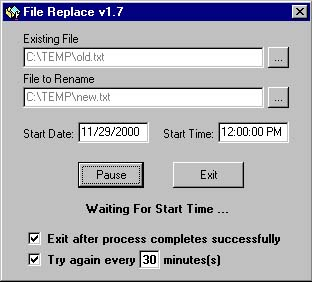



## Replace a file, now or later\!\! \(Updated\)

### Description

You can replace a file now or later. If you have apps that people use all day and if you make a change and have to replace the exe, but can't because someones in it, use this app. You enter the date and time for the replacement to happen.

It'll tell you if it was successful or if there was a problem on screen.

UPDATE - If a file is in use an the time goes past midnight the date will increment properly.
 
### More Info
 

             |
---                |---
**Submitted On**   |2000-11-30 14:55:44
**By**             |[Joe Maciejko](https://github.com/Planet-Source-Code/PSCIndex/blob/master/ByAuthor/joe-maciejko.md)
**Level**          |Beginner
**User Rating**    |4.0 (8 globes from 2 users)
**Compatibility**  |VB 5\.0, VB 6\.0
**Category**       |[Files/ File Controls/ Input/ Output](https://github.com/Planet-Source-Code/PSCIndex/blob/master/ByCategory/files-file-controls-input-output__1-3.md)
**World**          |[Visual Basic](https://github.com/Planet-Source-Code/PSCIndex/blob/master/ByWorld/visual-basic.md)
**Archive File**   |[CODE\_UPLOAD1220611302000\.zip](https://github.com/Planet-Source-Code/joe-maciejko-replace-a-file-now-or-later-updated__1-13202/archive/master.zip)

